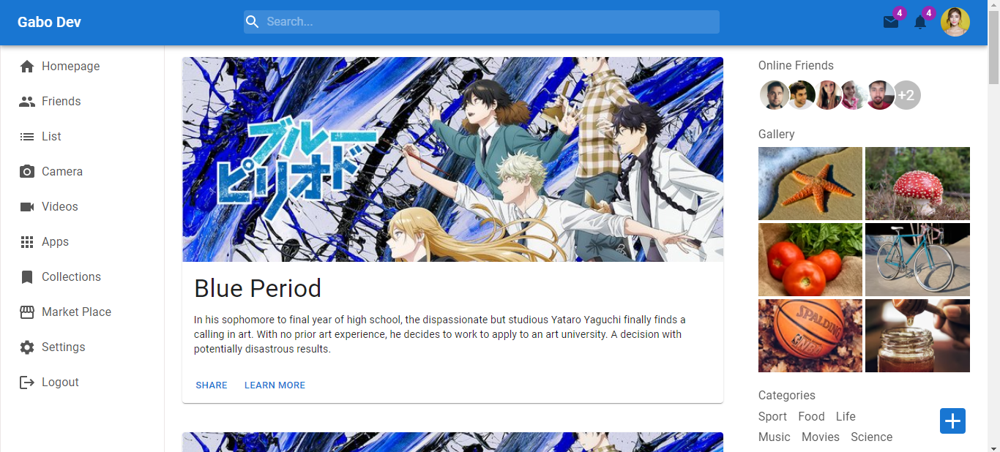

# Gabo Dev

> Aplicação web responsiva de uma rede social utilizando o Material UI.

## ☕ Usando Gabo Dev

Para usar Gabo Dev, clique no link abaixo:

[![Abrir com Netlifly]](https://gabo-dev.netlify.app/)

## 🤝 Colaborador

Agradecemos à seguinte pessoa que contribuíu para este projeto:

<table>
  <tr>
    <td align="center">
      <a href="https://github.com/gabomoreira">
         
        
          <b>Gabriel Moreira</b>
        
      </a>
    </td>
  </tr>
</table>
